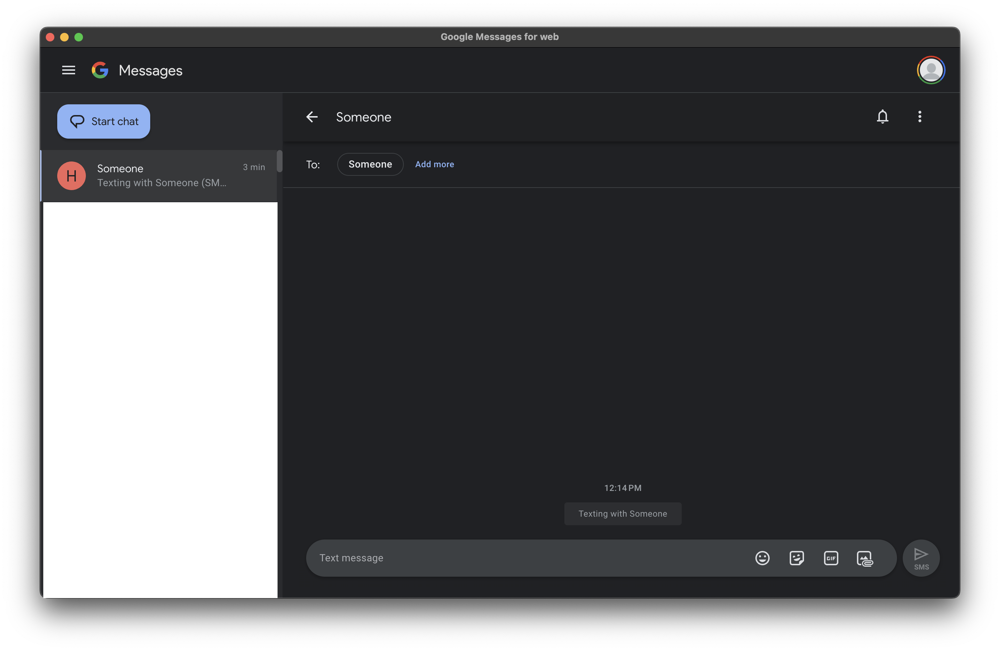

# Google Messages Desktop App 💬

This is an unofficial Google Messages desktop application built with Electron. It provides a convenient way to access and use Google Messages on your desktop.

## Features ✨

- Full access to Google Messages for Web.
- Native desktop experience with window controls and menus.
- Persistent login sessions.
- Optimized for performance and ease of use.

## Screenshots 📸



## Installation 📥

1. **Download the latest release:**
   - **macOS (arm64):** [Download](https://github.com/Alyetama/Google-Messages-Desktop/releases/download/v1.0.0/Google.Messages.Desktop-v1.0.0-arm64.dmg)

2. **Install the app:**
   - **macOS:** Open the `.dmg` file and drag the app to your Applications folder.

> ⚠️ Note: This build is for Apple Silicon Macs and supports macOS 10.12 and above.

## Development 🛠️

1. **Clone the repository:**

   ```bash
   git clone git@github.com:Alyetama/Google-Messages-Desktop.git
   ```

2. **Install dependencies:**

   ```bash
   npm install
   ```

3. **Start the development server:**

   ```bash
   npm start
   ```

## Building 🏗️

To build the app for different platforms, run:

```bash
npm run dist
```

This will create an installer (e.g., `.dmg` for macOS) in the `dist` directory.

## Contributing 🤝

Contributions are welcome! If you run into issues or have feature suggestions, feel free to open an issue or submit a pull request.

## License 📜

This project is licensed under the [MIT License](https://opensource.org/license/mit).
